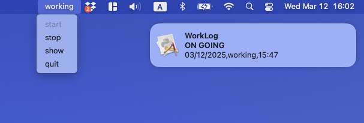
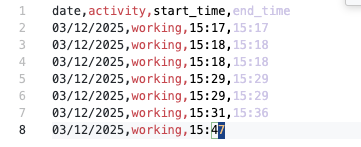

# WorkLog: logging app that you don't need

| App Example | CSV Example |
| :---: | :---: |
|  | 

  

Built for personal use, logging my coding times into a csv file.

To build and use: 

1. modify log file path in `WorkLog.py`

2. Modify and use the script in py2app-setup.sh